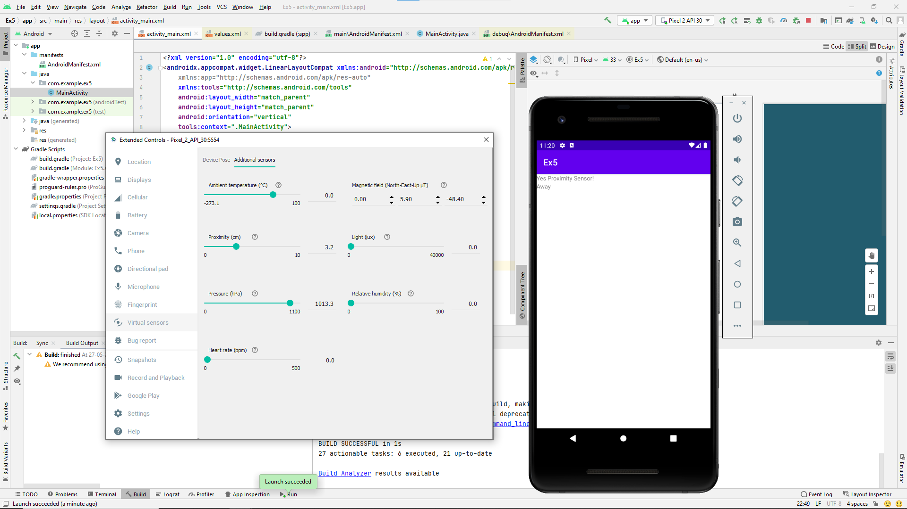

# Ex.No:5 Develop a simple application for proximity sensor using Sensor Manager in android studio.


## AIM:

To develop a sensor application for proximity sensor using sensor manager in Android Studio.

## EQUIPMENTS REQUIRED:

Android Studio(Min.required Artic Fox)

## ALGORITHM:

Step 1: Open Android Stdio and then click on File -> New -> New project.

Step 2: Then type the Application name as proximitysensor and click Next. 

Step 3: Then select the Minimum SDK as shown below and click Next.

Step 4: Then select the Empty Activity and click Next. Finally click Finish.

Step 5: Design layout in activity_main.xml.

Step 6: Display process of proximitysensor in android mobile devices.

Step 7: Save and run the application.

## PROGRAM:
```
/*
Program to print the process of proximitysensor in android mobile devices”.
Developed by: Hariharan.M
Registeration Number : 212221230034
*/
```
### MainActivity.java
```
package com.example.ex5;

import androidx.appcompat.app.AppCompatActivity;

import android.content.Context;
import android.hardware.Sensor;
import android.hardware.SensorEvent;
import android.hardware.SensorEventListener;
import android.hardware.SensorManager;
import android.os.Bundle;
import android.widget.TextView;

public class MainActivity extends AppCompatActivity {
    TextView ProximitySensor,data;
    SensorManager mySensorManager;
    Sensor myProximitySensor;
    @Override
    protected void onCreate(Bundle savedInstanceState) {
        super.onCreate(savedInstanceState);
        setContentView(R.layout.activity_main);
        ProximitySensor =(TextView) findViewById(R.id.proximitySensor);
        data =(TextView) findViewById(R.id.data);
        mySensorManager = (SensorManager) getSystemService(Context.SENSOR_SERVICE);
        myProximitySensor=mySensorManager.getDefaultSensor(Sensor.TYPE_PROXIMITY);
        if(myProximitySensor==null){
            ProximitySensor.setText("No Proximity Sensor!");
        }
        else{
            ProximitySensor.setText("Yes Proximity Sensor!");
            mySensorManager.registerListener(proximitySensorEventListener,myProximitySensor,SensorManager.SENSOR_DELAY_NORMAL);
        }
    }
    SensorEventListener proximitySensorEventListener=new SensorEventListener() {
        @Override
        public void onSensorChanged(SensorEvent sensorEvent) {

            if(sensorEvent.sensor.getType()==Sensor.TYPE_PROXIMITY){
                if(sensorEvent.values[0]==0){
                    data.setText("Near");
                }
                else{
                    data.setText("Away");
                }
            }
        }

        @Override
        public void onAccuracyChanged(Sensor sensor, int i) {

        }
    };
}
```
### activity_main
```
<?xml version="1.0" encoding="utf-8"?>
<androidx.appcompat.widget.LinearLayoutCompat xmlns:android="http://schemas.android.com/apk/res/android"
    xmlns:app="http://schemas.android.com/apk/res-auto"
    xmlns:tools="http://schemas.android.com/tools"
    android:layout_width="match_parent"
    android:layout_height="match_parent"
    android:orientation="vertical"
    tools:context=".MainActivity">

    <TextView
        android:id="@+id/proximitySensor"
        android:layout_width="wrap_content"
        android:layout_height="wrap_content"
        tools:layout_editor_absoluteX="178dp"
        tools:layout_editor_absoluteY="170dp" />

    <TextView
        android:id="@+id/data"
        android:layout_width="wrap_content"
        android:layout_height="wrap_content"
        tools:layout_editor_absoluteX="400dp"
        tools:layout_editor_absoluteY="273dp" />
</androidx.appcompat.widget.LinearLayoutCompat>
```
### Manifest.xml
```
<?xml version="1.0" encoding="utf-8"?>
<manifest xmlns:android="http://schemas.android.com/apk/res/android"
    package="com.example.ex5">

    <application
        android:allowBackup="true"
        android:icon="@mipmap/ic_launcher"
        android:label="@string/app_name"
        android:roundIcon="@mipmap/ic_launcher_round"
        android:supportsRtl="true"
        android:theme="@style/Theme.Ex5">
        <activity
            android:name=".MainActivity"
            android:exported="true">
            <intent-filter>
                <action android:name="android.intent.action.MAIN" />

                <category android:name="android.intent.category.LAUNCHER" />
            </intent-filter>
            <meta-data
                android:name="android.app.lib_name"
                android:value=""
                />
        </activity>
    </application>

</manifest>
```
## OUTPUT




## RESULT
Thus a Simple Android Application to display the details of proximity sensor using sensor manager in Android Studio is developed and executed successfully.
